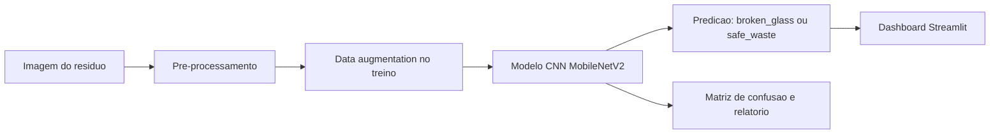

# AI Smart Waste

Projeto da Trilha 1 do Demoday: um sistema de visao computacional para analisar imagens de residuos e detectar risco de vidro quebrado no meio do lixo.

## Problema

A triagem manual de residuos pode falhar quando ha vidro quebrado misturado com outros materiais. Isso gera risco de acidente para equipes de limpeza, catadores, operadores de esteira e pessoas que manipulam o descarte.

## Solucao

O projeto treina uma rede neural para classificar imagens em duas classes:

- `broken_glass`: existe vidro quebrado ou fragmentos cortantes na imagem.
- `safe_waste`: nao ha vidro quebrado visivel.

Na demo, o usuario envia uma imagem e o sistema retorna:

- a classe prevista;
- a confianca do modelo;
- um alerta de risco quando vidro quebrado for detectado;
- uma explicacao visual simples para apoiar a apresentacao.

## Arquitetura



Arquivo do diagrama: [docs/architecture.mmd](docs/architecture.mmd)

## Estrutura do dataset

Coloque as imagens nesta estrutura:

```text
data/raw/
  train/
    broken_glass/
    safe_waste/
  val/
    broken_glass/
    safe_waste/
  test/
    broken_glass/
    safe_waste/
```

Use imagens variadas:

- vidro quebrado em sacos, caixas, mesas, chao e lixeiras;
- cacos transparentes, verdes e marrons;
- residuos parecidos com vidro, como plastico transparente, metal brilhante e papel laminado;
- imagens com diferentes iluminacoes, distancias e fundos.

## Instalar

```bash
python -m venv .venv
.venv\Scripts\activate
pip install -r requirements.txt
```

## Preparar divisao balanceada

Se as imagens ja estiverem em `data/raw`, gere uma divisao nova em `data/processed`:

```bash
python -m smart_waste.prepare_dataset --source-dir data/raw --output-dir data/processed --overwrite
```

Isso preserva o dataset original e cria uma divisao aproximada de 70% treino, 15% validacao e 15% teste.

## Treinar

```bash
python -m smart_waste.train --data-dir data/processed --epochs 10
```

O treino gera:

- `artifacts/model.keras`
- `artifacts/labels.json`
- `artifacts/history.csv`

## Avaliar

```bash
python -m smart_waste.evaluate --data-dir data/processed
```

A avaliacao gera:

- `reports/confusion_matrix.png`
- `reports/classification_report.txt`

Esses arquivos ajudam diretamente nos criterios de resiliencia, falsos positivos e falsos negativos da rubrica.

## Rodar demo

No terminal do VS Code, dentro da pasta do projeto, rode:

```powershell
.\.venv\Scripts\python -m streamlit run app.py --server.port 8501
```

Depois abra no navegador:

```text
http://localhost:8501
```

Envie uma imagem de residuo para ver a decisao de seguranca, o score de vidro quebrado e as probabilidades do modelo.

## Inferencia por terminal

```bash
python -m smart_waste.predict caminho/para/imagem.jpg
```

## Criterios da Trilha 1

### Dataset e pre-processamento

O pipeline usa redimensionamento, normalizacao e data augmentation com flip, rotacao, zoom e contraste. Isso melhora a generalizacao e reduz dependencia de fundo ou iluminacao.

### Arquitetura da rede neural

O modelo usa transfer learning com MobileNetV2 pre-treinada em ImageNet. A base convolucional extrai caracteristicas visuais e o topo do modelo aprende a separar `broken_glass` de `safe_waste`.

### Resiliencia e falsos positivos

A avaliacao gera matriz de confusao e relatorio com precision, recall e F1-score. Para este problema, falso negativo e mais grave: dizer que uma imagem e segura quando existe vidro quebrado. Por isso, a demo usa um limiar configuravel para disparar alerta de risco. O valor padrao e `0.30`, favorecendo recall para `broken_glass`.

## Evolucao com deteccao por caixas

Se voces quiserem marcar exatamente onde esta o vidro quebrado, o proximo passo e treinar um detector YOLO com imagens anotadas por bounding boxes. Para a entrega atual, o classificador binario e mais rapido de treinar e suficiente para demonstrar inferencia de maquina substituindo a decisao humana.
